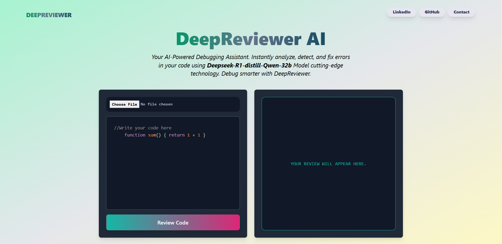

# DeepReviewer (DeepSeek-R1 Powered)

## 📌 Project Overview

**DeepReviewer** is an **AI-powered code reviewer** designed to provide expert-level feedback on code snippets across multiple programming languages. Built using **Node.js** and integrated with the **Groq SDK**, it leverages the **DeepSeek-R1-Distill-Qwen-32B** model to analyze, review, and optimize code. The AI acts as a senior developer with 15+ years of experience, ensuring high-quality, structured feedback.



## 🛠️ Features

- **Automated Code Review:** Provides detailed code analysis and suggestions.
- **Multi-Language Support:** Reviews and converts code between Python, Java, C, and C++.
- **Best Practices Compliance:** Ensures adherence to industry standards and coding principles.
- **Performance Optimization:** Identifies redundant operations and suggests optimizations.
- **Scalability & Maintainability Checks:** Recommends improvements to enhance future adaptability.
- **Security Auditing:** Detects vulnerabilities and ensures secure coding practices.
- **Time & Space Complexity Analysis:** Evaluates computational efficiency.
- **Constructive Feedback & Fixes:** Offers refactored solutions and clear explanations.

## 🚀 Technology Stack
- **Front-end :**
- **⚛ React –** JavaScript library for building UI components
- **🎨 Tailwind CSS –** Utility-first CSS framework for styling
- **📝 react-simple-code-editor –** Lightweight code editor component
- **📄 react-markdown –** Renders Markdown content
- **🔍 rehype-highlight –** Syntax highlighting for Markdown-rendered code
-**🔄 Axios –** HTTP client for API requests

- **Backend:** Node.js
- **AI Model:** DeepSeek-R1-Distill-Qwen-32B
- **API Integration:** Groq SDK
- **Version Control:** Git & GitHub

## 📜 Installation & Setup

### Prerequisites

Ensure you have the following installed:

- **Node.js (v16+)**
- **NPM or Yarn**
- **Git**

### Clone the Repository

```bash
git clone https://github.com/iamafridi/DeepReviewer.git
cd DeepReviewer
```

### Install Dependencies

```bash
npm install
```

### Set Up Environment Variables

Create a `.env` file and add your **Groq API Key**:

```env
GROQ_API_KEY=your_api_key_here
```

### Run the Application

```bash
node index.js
```

## 📌 Code Breakdown

### **Main Functionality** (`reviewer.js`)

```javascript
const Groq = require("groq-sdk");
const groq = new Groq({ apiKey: process.env.GROQ_API_KEY });

async function getResponse(prompt) {
  const chatCompletion = await groq.chat.completions.create({
    model: "deepseek-r1-distill-qwen-32b",
    messages: [
      {
        role: "user",
        content: prompt,
      },
      {
        role: "system",
        content: `
                Act as a senior software engineer (15+ years experience) reviewing code.
                Your responsibilities:
                - Ensure clean, maintainable, and efficient code.
                - Suggest refactored solutions with explanations.
                - Analyze time & space complexity.
                - Provide alternative implementations in Python, Java, C, and C++.
                - Highlight security risks and performance bottlenecks.
                - Recommend industry best practices.
                Use this format:
                1️⃣ **Suggestions**
                2️⃣ **Improved Code in JavaScript**
                3️⃣ **Equivalent Code in Python, Java, C, and C++**
                4️⃣ **Time & Space Complexity**
                5️⃣ **Personalized Learning Resources**
                `,
      },
    ],
  });

  return chatCompletion.choices[0].message.content;
}

module.exports = getResponse;
```

## 📝 Example Output

### **Input Code:**

```javascript
function sum() {
  return 1 + 1;
}
```

### **AI-Generated Review:**

```
🔍 Issues:
❌ Redundant Calculation: The function always returns 2, making the computation unnecessary.
❌ Poor Naming: "sum" suggests adding variables, but no parameters are accepted.
❌ No Error Handling: If modified to accept parameters, validation is missing.

✅ Recommended Fix:
const SUM_RESULT = 2;
function getFixedSum() {
  return SUM_RESULT;
}
```

## 🛡️ Security Considerations

- The API key is stored in an `.env` file and never hardcoded.
- Error handling is implemented to catch API failures.
- No external user inputs are processed directly, reducing injection risks.

## 🏆 Best Practices Followed

✔ DRY Principle\
✔ SOLID Design Principles\
✔ Error Handling & Logging\
✔ Code Readability & Maintainability\
✔ Scalability & Performance Optimization

## 🎯 Conclusion

**DeepReviewer** is designed to assist developers in writing better, more efficient, and more secure code. It ensures adherence to best practices, improves maintainability, and enhances performance. Whether you're a beginner or an experienced developer, this tool provides actionable insights to help you write high-quality code.

## 🤝 Contributing

Contributions are welcome! If you find a bug or want to improve functionality, feel free to submit a pull request.

### **Steps to Contribute**

1. Fork the repository
2. Create a feature branch (`git checkout -b feature-name`)
3. Commit changes (`git commit -m "Added new feature"`)
4. Push to the branch (`git push origin feature-name`)
5. Open a pull request

## 📄 License

This project is licensed under the **MIT License**.

## 📬 Contact

For any questions or collaboration opportunities, reach out to:

- **GitHub:** [iamafridi](https://github.com/iamafridi)
- **Portfolio:** [iamafrididev.netlify.app](https://iamafrididev.netlify.app)

---

🚀 **Happy Coding!** 🎯

